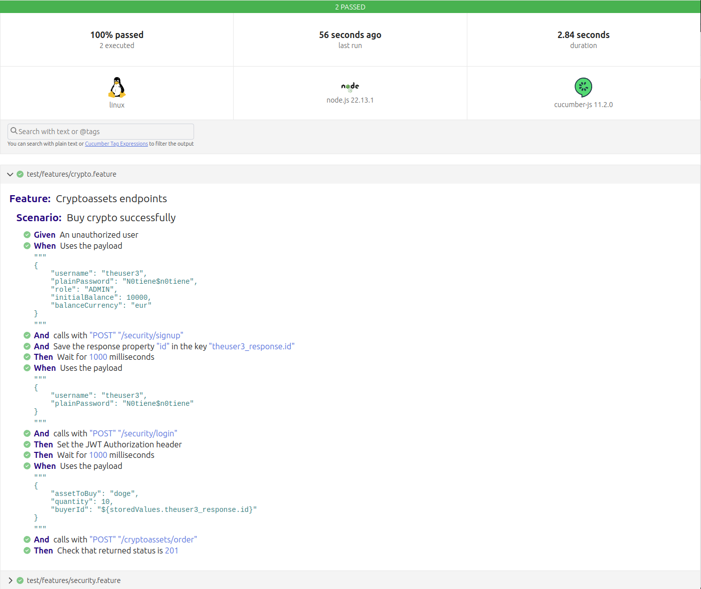
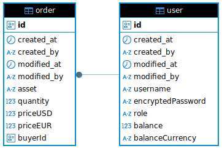

# Servicio de Gestión de Criptoactivos

Para ejecutar el proyecto

> ⚠️ Recuerda revisar las variables de entorno en `docker-compose.yml` y añadir tu API key de CoinGecko en `COINGECKO_API_KEY`

```shell
docker compose up -d
```

Abrir el navegador y dirigirse a [http://localhost:3000/api](http://localhost:3000/api)

El flujo recomendado es:

1) Crear un usuario a través del endpoint `/security/signup`
2) Hacer login con el usuario y obtener el token JWT a través del endpoint `/security/login`
3) Clickar sobre el botón `Authorize` e introducir el token JWT
4) Crear una orden de compra a través del endpoint `/criptoassets/order`

# Variables de entorno

El sistema es configurable desde fuera a través de las siguientes variables de entorno

```env
# Coingecko
COINGECKO_API_KEY=<poner_aqui_vuestra_api_key>
COINGECKO_API_BASE_URL=https://api.coingecko.com/api/v3

# Database
DATABASE_HOST=localhost
DATABASE_PORT=5432
DATABASE_USER=crypto_admin
DATABASE_PASSWORD=super_strong_password
DATABASE_NAME=crypto_db
DATABASE_LOGGING=true

# SECURITY
JWT_SECRET=dKXx9a6k$6gpQHS9ultB&8E32N5btFHJ
JWT_EXPIRES_IN=2h
JWT_ISSUER=crypto-asset-manager-issuer
```

# Tests

Para ejecutar los tests unitarios

```shell
npm install
```

Y después

```shell
npm tests
```

```shell
PASS  src/modules/cryptoassets/order.service.spec.ts (8.346 s)
OrderService
  ✓ fails if user has not enough funds (2 ms)
  ✓ fails if quantity is equal or lower than zero (1 ms)
  ✓ fails if quantity is equal or lower than zero (2 ms)
  Create a new order
    ✓ if all data is correct, creates the order successfully (6177 ms)

Test Suites: 1 passed, 1 total
Tests:       4 passed, 4 total
```

Para ejecutar los tests e2e

> Si ya has ejecutado los tests anteriormente, debes borrar la carpeta ./test/data antes de cada ejecución

```shell
cd test
docker compose up -d
```

Y después, vuelve a la carpeta principal del proyecto (donde está ubicado `package.json`) y ejecuta

```shell
npm run test:cucumber
```

```shell
Calling [POST] http://localhost:3000/security/signup
    Then Check that returned status is 201
    And Check that response property "username" is "theuser2"
    And Check that response property "role" is "ADMIN"
    And Save the response property "id" in the key "theuser2_response.id"

2 scenarios (2 passed)
19 steps (19 passed)
0m02.837s (executing steps: 0m02.821s)
```

Se genera un informe de resultados en `./test-results/cucumber.html`



# Descripción de la arquitectura

Tecnologías utilizadas: **NestJS**, **PostgreSQL**, **Docker**, **Docker compose** y **Github Actions** como motor de integración continua.

Para interactuar con la base de datos de ha utilizado **TypeORM**

Para los tests unitarios se ha utilizado **Jest**

Para los tests e2e se ha utilizado **Gherkin** y **Cucumber** siguiendo una filosofía **BDD**

## Nestjs

La arquitectura que se ha seguido con Nestjs es la recomendada por la documentación oficial, con algunos añadidos en base a mi experiencia, concretamente:

* Instrumentación a través de `OpenTelemetry`
* HTTP Headers de seguridad estándar usando `helmet`
* Aproximación de programación funcional utilizando `Result`
* Decorador custom para obtención de token JWT fácilmente
* Filtro genérico de excepciones para evitar reinicios no deseados del servidor
* Validación de entrada de datos estricta utilizando `class-validator`. Todos los datos que se reciben por la API son validados para garantizar que recibimos el tipo de dato que el servicio espera recibir.
* Externalización de la configuración a través de variables de entorno en fichero `.env`
* Rate limiting (utilizando `Throttler`).

A partir de ahí se han definido 3 módulos
* **Security**. Responsable del login y signup en la API
* **Users**. Responsable de interactuar con la tabla `user` de la base de datos. No tiene ningún endpoint asociado.
* **Cryptoassets**. Responsable de la integración con el tercero (CoinGecko) y de la compra/venta (creación de `orders`)

Cada módulo se organiza internamente así:
* **dto**. Carpeta que contiene los objetos que se intercambian a nivel de API. Si los hay.
* **entities**. Carpeta que contiene las entidades de base de datos, si las hay.
* **guards**. Carpeta que contiene los guards de autenticación, si los hay
* **enums**. Carpeta que contiene los enumerados propios de ese modulo, si los hay
* **migrations**. Carpeta que contiene las migraciones de TypeORM para esa entidad, si las hay. En este caso, solo el módulo `users` tiene migraciones

## Docker

Se ha utilizado una construcción de imagen por fases, con una primera fase de `building` y una segunda fase de construcción de la imagen de `producción`. Algunos detalles:
* Se utiliza como imagen base `node:22.14-alpine` para reducir la superficie de ataque al máximo posible
* Además, al no especificar version de hotfix (22.14.XX), a cada generación de la imagen se aplicarán los hotfixes para esa versión

## CI/CD

Se han configurado dos flujos de CI/CD

* `build-nest`
  * Se ejecuta siempre, ante cualquier push o acción
  * Instala dependencias
  * Hace el build
  * Ejecuta los tests
* `publish-docker-hub`
  * Se ejecuta cuando se hace un tag en git
  * Hace el build de la imagen docker
  * Comprueba que la imagen no tenga vulnerabilidades conocidas graves utilizando la herramienta open source [grype](https://github.com/anchore/grype)
  * Hace un push a Docker Hub de la imagen construida con la versión especificada en el tag de git
  * También sube una versión de la imagen `latest`

## Integración con CoinGecko

La integración con el tercero que nos proporciona el valor de las criptomonedas se maneja en el servicio `coingecko.service.ts` y  es bastante sencilla.

En primer lugar, en el constructor se comprueba que las variables de entorno que necesitamos están informadas. De no ser así, se lanza una excepción que fuerza a que el servidor no se levante.

Si los datos son correctos, configuramos un cliente de axios con las especificaciones que CoinGecko describe en su documentación, que básicamente es establecer una cabecera con el API Key.

```typescript
@Injectable()
export class CoingeckoService {
  private readonly axiosClient: AxiosInstance;

  constructor(private readonly configService: ConfigService) {
    const key = this.configService.get<string>(Settings.COINGECKO_API_KEY);
    const coingeckoBaseUrl = this.configService.get<string>(
      Settings.COINGECKO_API_BASE_URL,
    );

    if (!key) {
      throw new InternalServerErrorException(
        `env variable ${Settings.COINGECKO_API_KEY} is not set`,
      );
    }

    if (!coingeckoBaseUrl) {
      throw new InternalServerErrorException(
        `env variable ${Settings.COINGECKO_API_BASE_URL} is not set`,
      );
    }

    this.axiosClient = axios.create({
      baseURL: coingeckoBaseUrl,
      headers: {
        Accept: 'application/json',
        'x-cg-demo-api-key': key,
      },
    });
  }
}
```

Una vez configurado el cliente, ya solo es cuestión de hacer las llamadas a los endpoints que nos interesan, por ejemplo:

```typescript
public async getCurrentCoinsPrice(
  coins: Coins[],
): Promise<Result<CoinsPriceResponse, HttpException>> {
  try {
    const res = await this.axiosClient.get(
      `/simple/price?ids=${coins.join(',')}&vs_currencies=eur,usd&precision=full`,
    );

    return makeSuccess(res.data as CoinsPriceResponse);
  } catch (e) {
    return makeFailure(new InternalServerErrorException(e));
  }
}
```

Nótese el uso de `Result<CoinsPriceResponse, HttpException>`. Siguiendo patrones de programación funcional, se ha tomado esta decisión de diseño por varios motivos:

1. Unificar el tratamiento de éxitos y fracasos en el backend
2. Evitar el lanzamiento de excepciones desde la capa de servicios, ya que una excepción no manejada a nivel de servicio provoca que el servidor se caiga. Si estamos en un entorno de Kubernetes, provocaría el reinicio del contenedor. En docker-compose directamente se cae y no se reinicia.
3. Además, el lanzamiento y tratamiento de excepciones es costoso a nivel temporal y computacional, encapsulándolas en un objeto `Result` mejora el rendimiento general del backend (aunque sea un poquito)
4. Idiomáticamente, es más fácil comprender qué hace el código, por ejemplo:

```typescript
const result = await this.coinGeckoService.getCurrentCoinsPrice([
  Coins.BITCOIN,
  Coins.ETHEREUM,
  Coins.DOGE,
]);

if (isSuccess(result)) {
  return result.success;
} else {
  // Este throw está a nivel de controller, así que no provoca ningún reinicio. Al ser una excepción de tipo Http además, es idóneo para devolver el código que realmente queremos.
  throw result.failure;
}
```

## Modelo de base de datos

El modelo de base de datos es bastante sencillo



* A través de `created_by` y `modified_by` tenemos un control sobre cuándo y quién ha creado/modificado los datos
* El campo `encryptedPassword` contiene un hash asimétrico de la contraseña en texto plano. Esto significa dos cosas:
  * A partir del hash, no se puede volver a obtener la contraseña en texto plano otra vez. De modo que aunque nos robaran la base de datos, las contraseñas no se verían expuestas
  * La misma contraseña (en plano) no genera el mismo hash. De modo que tampoco se pueden hacer ataques por asociación. Ante la misma contraseña, el hash siempre va a ser diferente.
* Al iniciar el contenedor se ejecuta el script de creación de base de datos ubicado en la carpeta `database/create_database.sql`
* Una vez se inicia el backend, se aplican las migraciones.

La creación de órdenes de compra/venta tal y como está implementada puede tener condiciones de carrera entre la tabla `order` y el saldo en la tabla `user`.

Así es como lo resolvería:

1. Crearía una nueva tabla `OrdersDailyMovements`
2. Cada nueva orden creará una fila en esa tabla con la información de la orden (activo, cantidad, etc.)
3. La validación de los fondos del usuario (saldo) será contra la tabla User, pero en lugar de verificarlo directamente (user.balance > amount), recuperará primero todos los pedidos realizados por el usuario ese día en `OrdersDailyMovements`, y restará la cantidad de dinero gastada ese día. Si el saldo sigue siendo positivo, se aprobará la operación y se creará la orden. De lo contrario, la orden fallará
con un mensaje de Out of Funds
4. De esa manera, no es posible tener una condición de carrera, porque no estamos escribiendo y leyendo, solo estamos
escribiendo un "log de órdenes", y verificando que todas las órdenes sean consistentes con las reglas de negocio en cada nueva orden
5. Cada noche, tendremos un proceso de consolidación, que procesa todas las órdenes para cada usuario y actualiza el saldo en consecuencia
6. Si se crea una nueva orden en medio de ese proceso, no pasa nada malo. Esas órdenes se almacenarán en `OrdersDailyMovements`, como las órdenes creadas el día anterior y se procesarán al día siguiente. En el caso de que se haya creado una orden mientras se está ejecutando el proceso de consolidación, aún podemos saber si el usuario tiene fondos, solo necesitamos obtener el saldo del usuario, recuperar todas las órdenes asociadas a ese usuario en `OrdersDailyMovements`, procesarlas y restar los montos del saldo del usuario, y verificar si hay suficiente dinero para la orden. 

No lo he implementado porque supongo que está fuera del alcance de este desafío ;)
